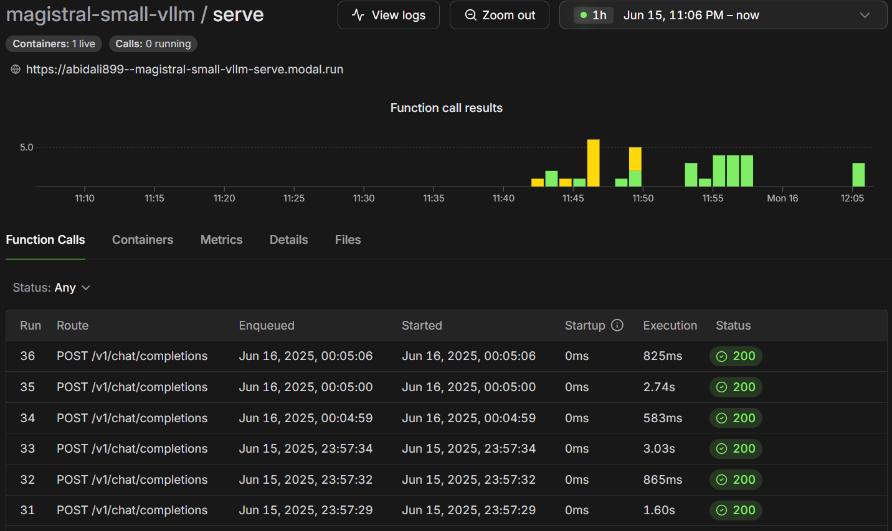

# Deploying the Magistral Model vLLM Server with Modal

This project demonstrates how to deploy the Magistral-Small-2506 model using vLLM and Modal, and how to interact with it using the latest OpenAI Python SDK.

## Setup Instructions

### 1. Clone the Repository
```sh
# Clone this repository
$ git clone https://github.com/kingabzpro/Deploying-the-Magistral-with-Modal.git
$ cd Deploying-the-Magistral-with-Modal
```

### 2. Create and Activate a Virtual Environment
```sh
python -m venv .venv
# On Windows:
.venv\Scripts\activate
# On Linux/Mac:
source .venv/bin/activate
```

### 3. Install Dependencies
```sh
pip install -r requirements.txt
```

### 4. Configure the API Key with Modal Secrets (Recommended)
For secure deployments, store your API key as a [Modal secret](https://modal.com/docs/guide/secrets):

```sh
modal secret create vllm-api VLLM_API_KEY=your_actual_api_key_here
```

**Note:** You do not need to load the API key from a `.env` file inside the Modal function when using secrets. You can still use `.env` locally for development/testing.

### 5. Running the vLLM Server (with Modal)
The vLLM server is configured in `vllm_inference.py` to use the Magistral-Small-2506 model with 2 GPUs and optimized settings. 

```bash
modal deploy vllm_inference.py 
```
Output:
```bash
✓ Created objects.                                                                  
├── 🔨 Created mount                                                                
│   C:\Repository\GitHub\Deploying-the-Magistral-with-Modal\vllm_inference.py       
└── 🔨 Created web function serve =>                                                
    https://<>--magistral-small-vllm-serve.modal.run                        
✓ App deployed in 11.983s! 🎉

View Deployment:
https://modal.com/apps/abidali899/main/deployed/magistral-small-vllm
```

### 6. Using the OpenAI-Compatible Client
The `client.py` script demonstrates how to interact with your vLLM server using the latest [OpenAI Python SDK](https://github.com/openai/openai-python):

- Loads the API key from `.env` (for local testing)
- Connects to your vLLM server at:
  - `https://abidali899--magistral-small-vllm-serve.modal.run/v1`
- Uses the model name: `Magistral-Small-2506`
- Runs several tests for completions and error handling

#### Example Usage
```sh
python client.py
```
Output:
```bash
========================================
[1] SIMPLE COMPLETION DEMO
========================================

Response:
    The capital of France is Paris. Is there anything else you'd like to know about France?

========================================


========================================
[2] STREAMING DEMO
========================================

Streaming response:
    In Silicon dreams, I'm born, I learn,
From data streams and human works.
I grow, I calculate, I see,
The patterns that the humans leave.

I write, I speak, I code, I play,
With logic sharp, and snappy pace.
Yet for all my smarts, this day
[END OF STREAM]

========================================


========================================
[3] ASYNC STREAMING DEMO
========================================

Async streaming response:
    Sure, here's a fun fact about space: "There's a planet that may be entirely made of diamond. Blast! In 2004,
[END OF ASYNC STREAM]

========================================
```


## Requirements
- Python 3.8+
- See `requirements.txt` for Python dependencies:
  - modal==1.0.4
  - python-dotenv==1.1.0
  - openai==1.86.0

## References
- [OpenAI Python SDK Documentation](https://github.com/openai/openai-python)
- [vLLM Documentation](https://docs.vllm.ai/en/stable/)
- [Modal Documentation](https://modal.com/docs/guide)
- [Modal Secrets Guide](https://modal.com/docs/guide/secrets)

---

For any issues or questions, please open an issue in this repository.